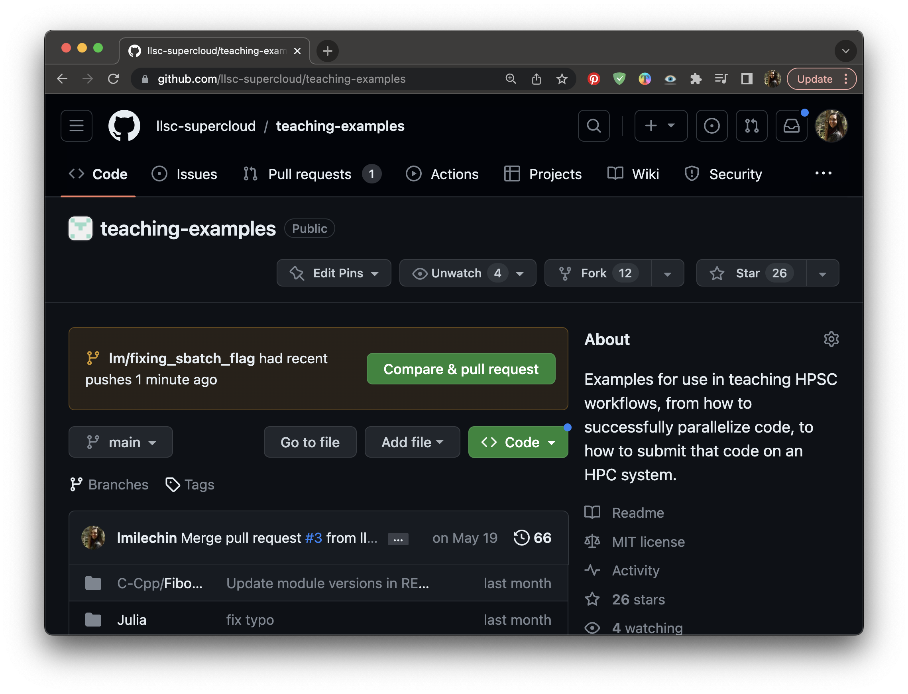
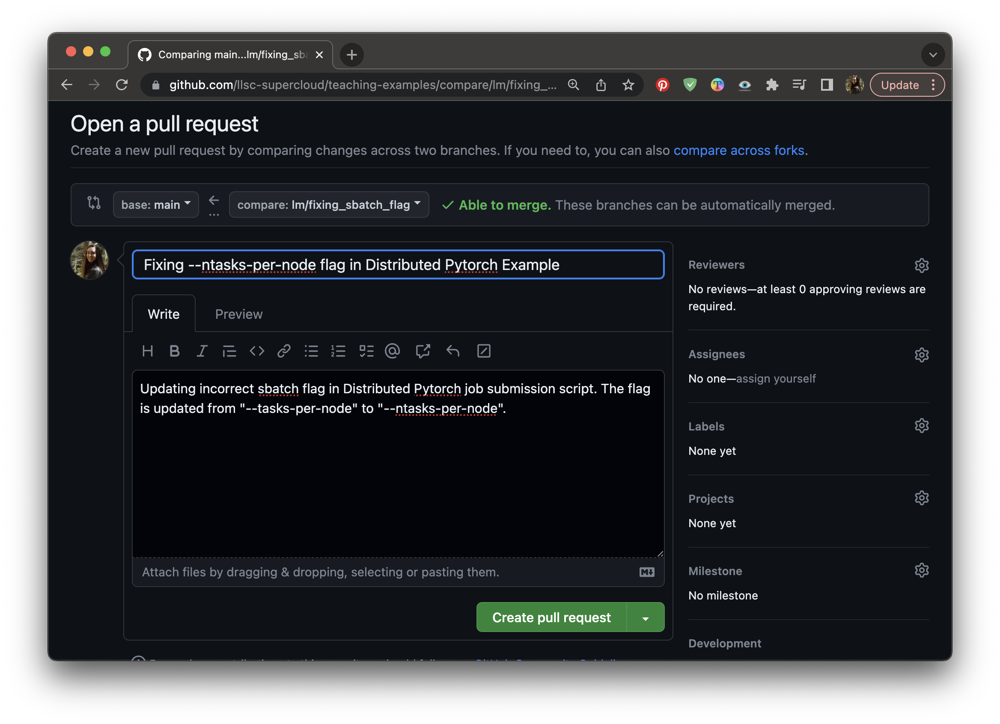

:::::::::::::::::::::::::::::::::::::: questions 

- What is a Pull Request?
- Why use Pull Requests?
- How do we use Pull Requests?

::::::::::::::::::::::::::::::::::::::::::::::::

::::::::::::::::::::::::::::::::::::: objectives

- Understand the Pull Request process
- Be able to create and merge a Pull Request

::::::::::::::::::::::::::::::::::::::::::::::::

## What are Pull Requests?

A Pull Request is a GitHub a process to request that a branch be merged into another branch. It's called a "Pull Request" because you are requesting that the change introduced be pulled into the other branch. In GitLab it is called a "Merge Request". Pull requests provide a process and an opportunity for code review before merging branches you don't own or manage by yourself, such as the main branch. They can also be a mechanism for proposing and discussing changes, and requesting additional changes be made before the branch is merged.

## Working with Pull Requests

### Creating a Pull Request

First, make sure you don't have any commits you haven't pushed to GitHub. Go to your local repository and run `git status`. If you have any commits you haven't yet pushed, push them now with `git push`. Remember, if you haven't pushed from this branch to the remote repository yet, you will be prompted to publish your branch with `git push --set-upstream origin my_new_branch`.

Now navigate to your branch in GitHub. If you've pushed any commits recently you may see a callout that says your branch has recent pushes and provides a button that says "Compare and Pull Request". Pressing this will bring you to the form to create your Pull Request to the main branch. If you don't have this button, you can select "Pull Requests" at the top of the page and select "New Pull Request". From there select your branch under the "compare" dropdown. If you would like to merge your branch into a branch other than main, select that branch under the "base" dropdown. Then select "Create Pull Request".

{alt="" width="75%"}
*Creating a Pull Request: If you recently pushed changes to your branch you may see a button that says "Compare and Pull Request" on GitHub.*

At this point you will see a form. Fill out the form with a title and description for the Pull Request, and then click "Create Pull Request". We will go more in depth on how to make good pull requests in a later section.

{alt="" width="75%"}
*Creating a Pull Request: Give your Pull Request a title and description.*

### Anatomy of a Pull Request

Once the Pull Request is created there are a few different tabs on the page. The first is the conversation tab, which shows a timeline of comments and commits, starting with the initial description that you gave when creating the Pull Request. At the bottom will be a box that shows the result of any Continuous Integration that has been defined, such as automated tests (the one in the image doesn't have any set up), as well as whether there are any merge conflicts for the Pull Request.

{alt="" width="75%"}
*The conversation tab of a Pull Request.*

At the very bottom of the page is a box where you can leave a comment. GitHub supports markdown so you can include formatting with your comment.

{alt="" width="75%"}
*The conversation tab of a Pull Request. Scroll to the bottom of the page to leave a comment.*

There is also a tab that shows all the commits in the Pull Request (the Commits tab). The last Files Changed tab shows the diff between the base branch and the Pull Request branch. This is useful in reviewing the Pull Request, and it allows you to leave in-line comments. If you see a line of code that needs to be updated or changed, you can click the + next to that line to leave a comment.

{alt="" width="75%"}
*The Files Changed tab of a Pull Request, showing what the proposed changes are for the Pull Request. You can click the + next to a line number to leave an in-line comment.*

### Updating a Pull Request

Once the Pull Request is created you and anyone with access to the repository can make comments on the request. These comments might be clarifying questions or requests for additional changes. If additional changes are needed, make those changes in your branch and push them. The commits will be added to the Pull Request automatically and appear on the main Conversation page.

### Accepting and Merging a Pull Request

Once a Pull Request has been reviewed and ready to be accepted, it can be merged. First verify that the branch has no conflicts with the base branch (the one that will be merged into). Any conflicts should be addressed with additional commits. When ready to merge, click "Merge Pull Request", then click "Confirm merge". You will be given the option to delete the branch. Whether you delete the branch depends on its purpose and how you and your group want to handle branches that have been merged. Deleting feature branches helps keep clutter down and makes it easier to find relevant branches. However, if you have any longer term branches, such as a development or production branch, you wouldn't want to delete that.

{alt="" width="75%"}
*After clicking the "Merge Pull Request" button on the conversation, click "Confirm Merge" to merge the pull request.*

## Activity

One team member should still have an unmerged branch from the previous exercise. If not, have one of you create a branch, introduce a small change, commit, push, then publish the branch.

Log into GitHub. The team member with the branch should create a pull request. Once it is created, everyone should look at the different parts of the PR and comment whether the branch looks okay to merge. The branch owner should make changes requested. If there are merge conflicts, those should be addressed (you can work together to address them). Once it is ready to merge, someone else on the team should merge the Pull Request.

In both this activity and the last one your branch was eventually merged into the main branch. How does this experience compare to the previous activity?

If you have extra time, the remaining team members can create their own Pull Requests with new branches.

## Additional Resources
- [Slide version of this lesson](https://github.com/INTERSECT-training/collaborative-git/blob/main/presentations/CollaborativeGit.pdf)

::::::::::::::::::::::::::::::::::::: keypoints 

- A Pull Request is a GitHub a process to request that a branch be merged into another branch.
- Pull requests provide a process and an opportunity for code review before merging branches and can be a mechanism for proposing, discussing, and requesting changes before the branch is merged.

::::::::::::::::::::::::::::::::::::::::::::::::